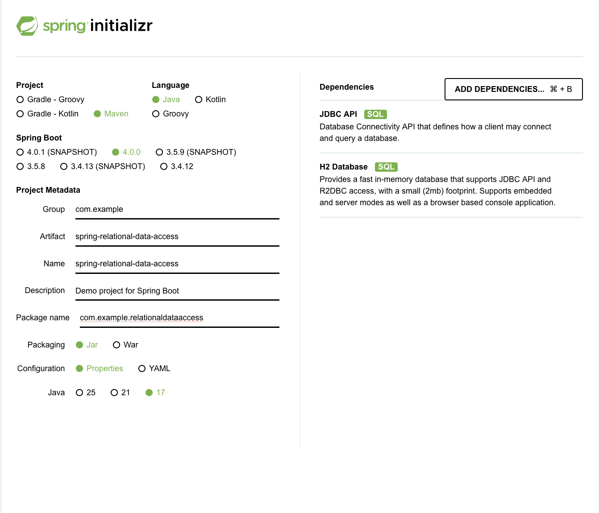

# Spring Initializr Setup (Relational Data Access)

Created from https://start.spring.io with:

- Project: Maven
- Language: Java
- Spring Boot: 4.0.0
- Group: `com.example`
- Artifact: `spring-relational-data-access`
- Name: `Relational Data Access`
- Description: Spring JDBC with JdbcTemplate and H2
- Package name: `com.example.relationaldataaccess`
- Packaging: Jar
- Java: 17
- Configuration: Properties
- Dependencies:
  - **JDBC API** - Spring JDBC support including JdbcTemplate
  - **H2 Database** - In-memory database for development and testing

# Final Spring Initializr configuration

